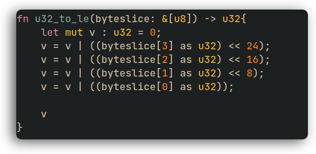

# Vimcap
A shell script to grab pretty screenshots of your code. I use it in Vim.

# Usage
1. In Vim, use `!vimcap` to execute the script. 
2. Capture the area of the code, and hit Enter.
3. The script should produce an image named `vimshot.png` in your $PWD.

# Installation
Put the Bash script anywhere in your $PATH.

# Screenshot

# Dependencies
- Vim (Any text editor really)
- Imagemagick (convert tool)
- Flameshot (Although you can swap it out easily)
